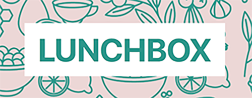

<b><h1 align='center'>Jackie Dunne</h1></b>
  

  <a href="https://www.linkedin.com/in/jackie-dunne-b8516155/">LinkedIn</a> |
  <a href="https://sourcerer.io/kiedunne">Sourcerer</a> |
  <a href="https://www.researchgate.net/profile/Jacklyn_Dunne2">ResearchGate</a>

  <a href="#skills">Skills</a> |
  <a href="#projects">Selected Projects</a> |
  <a href="#education">Education</a> |
  <a href="#experience">Experience</a> |
  <a href="#interests">Interests</a>

***

<h3 align='center'>I'm a full-stack developer and previous neuroscience researcher that has a passion for design and well-tested, maintainable code.</h3>

After spending the last decade working in many different realms of psychiatric and neuroscience research, including; spinal cord injury, neuroimaging, and drug addiction, I learnt how to code at <a href="http://www.makersacademy.com/">Makers Academy</a>, a dev bootcamp specializing in Ruby, Rails, Javascript, TDD and agile methodologies.

I'm looking for a junior developer role within a diverse, fast-paced team who are as passionate about creating unique digital products as I am.
 
## <a name="skills">Skills</a>

#### Technology

| Languages  | Testing          | Frameworks   | Libraries | Design        |  Project Management | Data Analysis  |     
| :----------|:-----------------| :------------| :---------| :-------------| :-------------------|:---------------|
| Ruby       | Rspec            |  Rails       | React     | Photoshop     |    PivotalTracker   |   R
| Javascript | Jasmine          |  Bootstrap   | JQuery    | Illustrator   |    Trello           |   SPSS
| Sass       | Capybara         |  Express     |           | Xd

#### Quick Learner 
In every lab I've worked or studied in, I've had to rapidly pick up new skills in different disciplines, ranging from neuroimaging techniques to patient assessments. While at Makers, I picked up multiple languages and fundamental design principles such as object-oriented programming at a similar rapid pace, all while teaching myself React and Adobe Xd to further explore front-end development and web design.

#### Adaptable
Filling many different roles while working on academic projects, such as researcher, manager and data scientist, has made me very quick to adapt to the needs of the project and my team. During our group engineering projects at Makers, I took on many roles across the entire product cycle, such as sketching out and implementing UI designs, testing back-end controllers or managing continuous integration and deployment. 

#### Creative
I'm a visual artist, I love creating unique compositions that challenge expectations with color and form. I approach every project I work on with this same enthusiasm to embrace alternative solutions to technical problems. 

#### Communication and Facilitation
My years of experience working with commissioners, researchers, students, and patients has given me skills in communicating solutions to complex problems in a succinct manner to audiences of various backgrounds. While working on our engineering projects at Makers, I often led the stand-ups and assigned tasks to each team member on our Trello boards, as well as assigned difficulty and time estimations.

## <a name="projects">Selected Projects</a>

| Project               | Stack             | Testing            | Details           |
| :-------------------: |-------------------| -------------------|-------------------|
|   [Lunchbox](https://github.com/kiedunne/Lunchbox) | Rails, Javascript, Jquery, SASS, PostgreSQL | RSpec, Capybara, FactoryBot,  SimpleCov, TravisCI | Meet new people in your area on your lunch break |
|  [Roman Numeral Converter](https://github.com/kiedunne/roman-numeral-converter)  | Ruby |  RSpec, Capybara, SimpleCov, Travis CI | A webapp roman numeral converter | 
| [Glia](https://github.com/kiedunne/glia-app)  | React, Rails | RSpec | Client progress manager for psychological clinicians|
| [Tic-tac-toe](https://github.com/kiedunne/tic-tac-toe)  | Javascript| Jasmine, Travis CI  | Business logic of tic-tac-toe in vanilla Javascript |

## <a name="education">Education</a>

**Makers Academy** (October 2018 - February 2019) 
Makers Academy is an intensive software development bootcamp that take people who are curious and passionate about coding and turn them into highly skilled developers. 

- OOP, TDD, BDD
- Agile/XP values
- Ruby, Rails, JavaScript
- RSpec, Jasmine, Cypress

**Yale University** (September 2014 -June 2015) 
*Masters neuroimaging thesis on interactions between stress and eating in the developing brain*

**University College London** (October 2013 - July 2014) 
*MSc. Developmental Neuroscience & Psychopathology*

**University of Ottawa** (September 2009 - May 2013 ) 
*Honours BSc. Specialization in Psychology*

## <a name="experience">Experience</a>

**King's College London, London, UK** (March 2016 to October 2018)    
*Researcher - Department of Addiction*  

**CLUG & Hurdler Studios, Vancouver, Canada** (September 2015 to June 2016)   
*Customer Support & Social Media Co-ordinator*

**Yale University, New Haven, USA** (September 2015 to June 2016)   
*Graduate Researcher- Department of Addiction*

**The Anna Freud Centre, London, UK** (December 2013 to April 2014)    
*Researcher - Evidence-based Practice Unit*

**The Ottawa Civic Hospital, Ottawa, Canada** (August 2012 to May 2013)    
*Researcher - Neurosurgery*

### <a name="interests">Interests</a>
- <a href="https://drive.google.com/open?id=1cE2pHIq6zSPubQbeUXKMxd23bLfuOAN3">Art & Design</a>  
- <a href="https://www.researchgate.net/profile/Jacklyn_Dunne2">Psychology & Neuroscience</a>
- Bouldering
